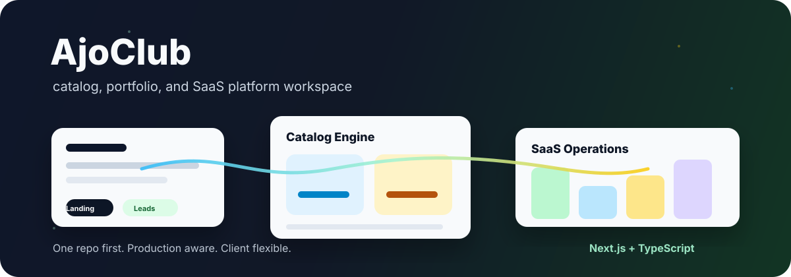
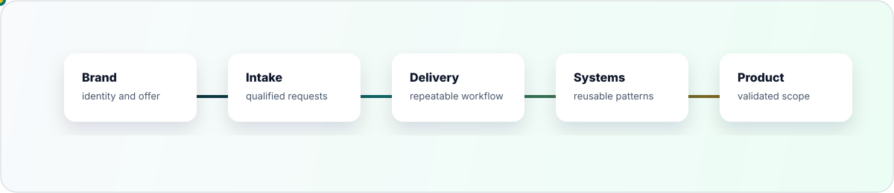
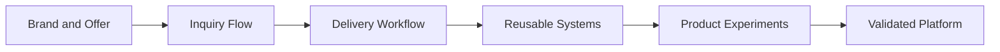

# AjoClub

[](#)
[](#roadmap)
[](#technical-base)
[](#license)
[](https://github.com/quaso-hub/ajoclub/commits)
[](#contributors)



AjoClub is a private workspace for shaping the company, its operating system,
and the software foundation behind future work.

This repo is not split into many projects yet because the business boundaries
are still moving. The first goal is a clear, maintainable foundation: one place
for the web app, product notes, delivery workflow, and technical decisions.

## Start Here

| Need | Go To | Status |
| --- | --- | --- |
| Understand the business direction | `docs/business/` | Planned |
| Track product scope and milestones | `docs/product/` | Planned |
| Read setup, architecture, and deployment notes | `docs/technical/` | Planned |
| Work on the main application | `apps/web/` | Planned |
| Check ownership and collaboration rules | [Contributors](#contributors), [Working Agreements](#working-agreements) | Active |

## Snapshot

| Layer | Current Focus | Output |
| --- | --- | --- |
| Brand | Define identity, offer, and positioning | Public-facing web foundation |
| Intake | Route serious inquiries into one flow | Contact and qualification path |
| Operations | Keep decisions and delivery notes traceable | Internal project memory |
| Delivery | Reuse patterns without forcing one stack on every client | Practical implementation playbook |
| Product | Validate real workflows before adding platform complexity | Future product scope |

## Repository Shape

```txt
ajoclub/
  apps/
    web/                    main web application
  packages/
    ui/                     shared interface primitives
    config/                 shared tooling config
  docs/
    business/               positioning, offers, pricing notes
    product/                roadmap, flows, milestones
    technical/              architecture, deployment, decisions
    assets/                 README visuals and documentation media
  README.md
```

## Repository Surface

| Surface | Path | Purpose | Owner |
| --- | --- | --- | --- |
| App | `apps/web` | Main application code | Maintainer |
| UI package | `packages/ui` | Shared interface pieces when reuse becomes real | Maintainer |
| Config package | `packages/config` | Shared lint, TypeScript, and tooling config | Maintainer |
| Business docs | `docs/business` | Offer, pricing, positioning, and market notes | Maintainer |
| Product docs | `docs/product` | Scope, flows, milestones, and decisions | Maintainer |
| Technical docs | `docs/technical` | Setup, architecture, deployment, and security | Maintainer |
| README assets | `docs/assets` | Visuals used by documentation | Maintainer |

## Operating Model





## Technical Base

The default internal stack should stay familiar and production-friendly:

| Area | Choice |
| --- | --- |
| Web | Next.js |
| Language | TypeScript |
| Styling | Tailwind CSS |
| Data | Supabase or PostgreSQL |
| Hosting | Vercel |
| Payment | Add only when the business flow requires it |

Client work can use a different stack when the job calls for it. AjoClub's own
base should optimize for speed, clarity, and maintainability.

## Roadmap

| Phase | Goal | Status |
| --- | --- | --- |
| 0. Repository foundation | Private repo, ignore rules, README, docs shape | Active |
| 1. Web foundation | Create `apps/web`, base layout, routing, design direction | Planned |
| 2. Business surface | Publish the first serious web flow for AjoClub | Planned |
| 3. Intake workflow | Capture and organize qualified inquiries | Planned |
| 4. Delivery memory | Document repeatable delivery patterns and handoff rules | Planned |
| 5. Product validation | Identify which workflows deserve product features | Later |
| 6. Platform buildout | Add dashboard, billing, automation, or roles only after validation | Later |

## Milestones

```txt
[x] Repository created
[x] Node .gitignore added
[x] README foundation established
[ ] Next.js app initialized
[ ] Docs folders created
[ ] First web flow implemented
[ ] Inquiry workflow connected
[ ] Deployment pipeline prepared
[ ] Product scope reviewed from real usage
```

## Documentation Rules

Keep project memory in `docs/`. Notes should be short, dated, and useful for the
next person opening the repo.

```txt
docs/business/     market notes, offers, pricing, positioning
docs/product/      scope, flows, milestones, product decisions
docs/technical/    setup, architecture, security, deployment
```

## Contributors

[](https://github.com/quaso-hub/ajoclub/graphs/contributors)

Contributor avatars are generated from GitHub history. Use the table below for
internal ownership, because contribution count does not always match decision
authority.

| Contributor | Role | Area | Notes |
| --- | --- | --- | --- |
| `quaso-hub` | Maintainer | Repository, implementation, technical direction | GitHub owner |
| `rstu` | Contributor | Project history | Seen in git history |

For fuller attribution later, add `all-contributors` or a GitHub Action that
updates this section from repository metadata.

## Working Agreements

| Topic | Agreement |
| --- | --- |
| Branches | Use short branch names that describe the work, for example `feat/web-foundation`. |
| Pull requests | Keep PRs scoped to one feature, decision, or cleanup. |
| Reviews | Review for correctness, maintainability, and whether the change matches the current business stage. |
| Decisions | Put durable decisions in `docs/product` or `docs/technical`, not only in chat. |
| Deployment | Do not wire production credentials or payment flows until the business flow is explicit. |
| Access | Treat repo access, client files, credentials, and pricing notes as private. |

## Guardrails

| Rule | Why |
| --- | --- |
| Keep one repo during discovery | Real boundaries should come from actual workflow, not guesses. |
| Avoid platform work too early | Dashboard, billing, and automation should follow validation. |
| Record decisions | Context should survive across teammates and future sessions. |
| Keep secrets out of Git | Business and client data must stay private. |
| Let client stacks vary | AjoClub can use Next.js internally without forcing it on every client. |

Do not commit:

```txt
.env
.env.local
.env.production
private client files
payment secrets
database credentials
```

## License

Private proprietary project. No open-source license is assigned.
