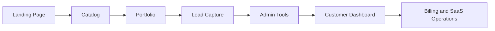
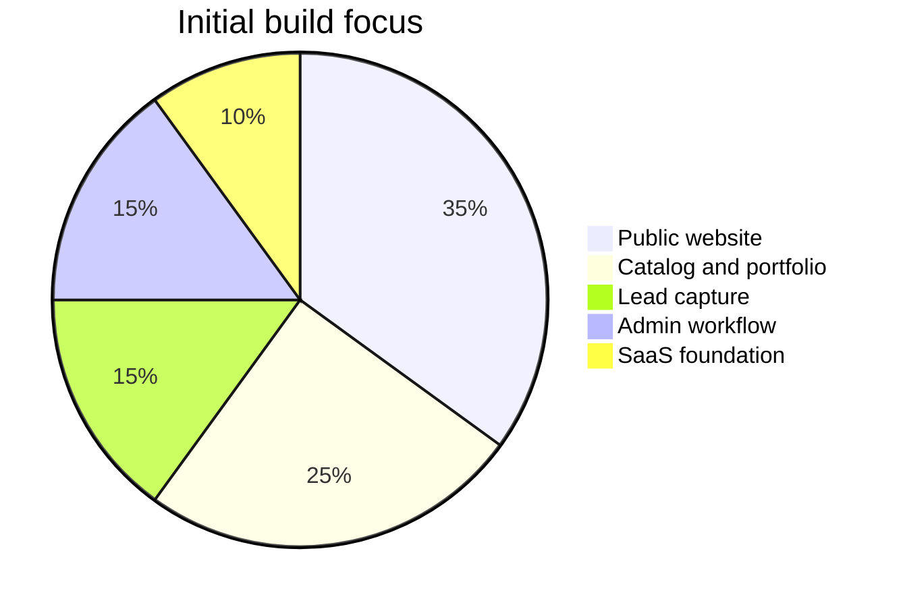

# AjoClub

> Website and SaaS platform for catalog, portfolio, and business operations.

[](#roadmap)
[](#tech-direction)
[](#license)


AjoClub is planned as a business platform that starts simple: landing page,
catalog, portfolio, and lead capture. From there, it can grow into a SaaS
product with admin tools, customer dashboard, billing, and operational workflows.

This repository is intentionally structured as one product workspace first.
The goal is to move fast without scattering brand assets, UI components,
business notes, and product code across separate repos too early.

## Product Surface

```txt
ajoclub.com/              landing page
ajoclub.com/catalog       product or service catalog
ajoclub.com/portfolio     portfolio and case studies
ajoclub.com/contact       lead form and business inquiry
ajoclub.com/admin         internal content and catalog management
ajoclub.com/dashboard     future SaaS customer workspace
```

## Repository Shape

```txt
ajoclub/
  apps/
    web/                  Next.js application
  packages/
    ui/                   shared UI components
    config/               shared TypeScript, lint, and tooling config
  docs/
    business/             business model, offer, pricing notes
    product/              feature planning and product decisions
    technical/            architecture and implementation notes
  README.md
```

## Direction



## Tech Direction

The preferred stack for the first implementation:

```txt
Next.js
TypeScript
Tailwind CSS
Supabase or PostgreSQL
Vercel
Midtrans, Xendit, or Stripe when payment is needed
```

The stack can change for client projects when needed, but AjoClub itself should
use the tools that are fastest to maintain and ship.

## MVP Balance



## Build Philosophy

| Principle | Meaning |
| --- | --- |
| Brand first | Keep the repo name, content, design, and product direction aligned around AjoClub. |
| One repo first | Keep landing, catalog, portfolio, admin, and early SaaS code together while the product is still evolving. |
| Production aware | Structure the project so it can grow into real deployment, not just a demo. |
| Client flexible | AjoClub can showcase work for many client stacks without forcing every client into the same technology. |
| Document decisions | Business, product, and technical decisions should be written down as the project evolves. |

## Roadmap

```txt
[x] Create private repository
[x] Add Node .gitignore
[x] Add initial README
[ ] Create Next.js web app
[ ] Build landing page
[ ] Build catalog page
[ ] Build portfolio page
[ ] Add contact or waitlist form
[ ] Add admin content workflow
[ ] Prepare production deployment
[ ] Add SaaS dashboard when the business model is clearer
```

## Suggested First Milestone

The first usable milestone should be a polished public website:

1. Landing page with clear offer and positioning.
2. Catalog page for services or products.
3. Portfolio page for proof of work.
4. Contact form or waitlist.
5. Basic admin plan for updating catalog content.

After that, the SaaS features can be planned with better business clarity.

## Development Notes

This repository is private while the business, pricing, and product strategy are
still being shaped. Avoid committing secrets, API keys, payment credentials, or
private client data.

Use environment files locally and keep them out of Git:

```txt
.env
.env.local
.env.production
```

## License

Private proprietary project. No open-source license is assigned yet.
